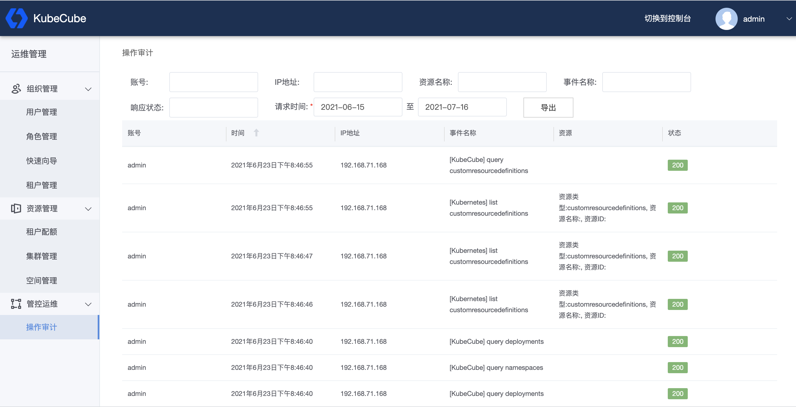

# Kubeworkz Audit

Kubeworkz audit provides audit services for Kubeworkz, recording and managing the audit logs generated by Kubeworkz and Kubernetes.

## What it does

It can help cluster administrator deal with the following issues:

- What happened?
- When did it happen?
- Who triggered？
- On which object(s) the activity occurred？
- Where was observed？
- Where did it trigger？
- What is the follow-up behavior of the event？

## Instructions for use

- Kubeworkz audit will also be deployed at the same time as the user "all in one" deployment. It will receive audit logs from Kubeworkz and Kubernetes.

- The service will send the received logs to the configured Elasticsearch address (if the user has not configured an Elasticsearch address, it will be sent to the internal Elasticsearch).

- The audit function is enabled by default. If you want to disable the audit function, refer to [Audit operation audit usage document interface](https://www.kubeworkz.io/docs/user-guide/administration/audit/)

### Query and Export



#### Query

It Provides the function of query audit logs, users can query the generated audit logs on the page, and kubeworkz-audit will query the logs in Elasticsearch.

The function is limited to the platform administrator, and the entrance is not open to users with other roles.

#### Export

It Supports exporting of the audit results found, with the same authority restrictions as above.

The user first queries the log, and when choosing to export, the default is to re-query according to the filter parameters just queried, and the number of queries is not more than 10,000. The file format defaults to csv format.

## License

```
Copyright 2024 Kubeworkz Authors

Licensed under the Apache License, Version 2.0 (the "License");
you may not use this file except in compliance with the License.
You may obtain a copy of the License at

    http://www.apache.org/licenses/LICENSE-2.0

Unless required by applicable law or agreed to in writing, software
distributed under the License is distributed on an "AS IS" BASIS,
WITHOUT WARRANTIES OR CONDITIONS OF ANY KIND, either express or implied.
See the License for the specific language governing permissions and
limitations under the License.
```

